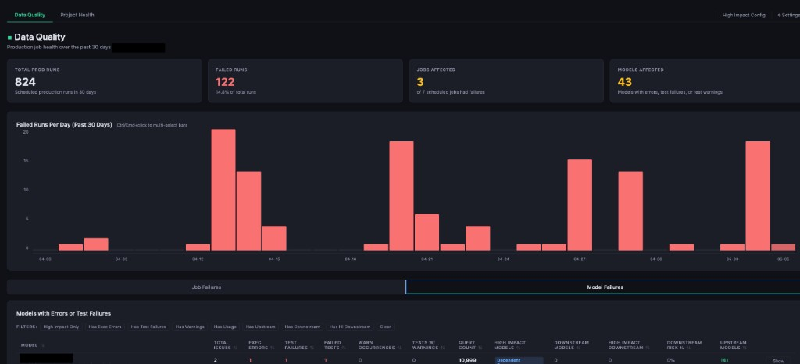

# dbt Health Check

Local dashboard that connects to **dbt Cloud** (Discovery + Admin APIs) and summarizes **Data Quality**, **Project Health**, and **Dead Models**. All data stays on your machine except HTTPS calls to your own dbt Cloud account.

## Quick start

**Prerequisites:** Python **3.8+** and a dbt Cloud **service token** (read + metadata).

### macOS / Linux

```bash
git clone https://github.com/mfreeborndbt/dbt_health_check_app.git && cd dbt_health_check_app && python3 run.py
```

### Windows

```powershell
git clone https://github.com/mfreeborndbt/dbt_health_check_app.git; cd dbt_health_check_app; python run.py
```

**That's it.** The launcher handles everything automatically:

- Creates a `.venv` and installs dependencies (skips if nothing changed)
- Kills any stale instance from a previous run
- Finds a free port if 5556 is busy (another app, old instance, anything)
- Auto-pulls the latest code from `main`
- Opens your browser

Already cloned? Just run `python3 run.py` again — it always works.

| Option | Example |
|--------|---------|
| Different port | `python3 run.py --port 8080` |
| All interfaces (Docker) | `python3 run.py --host 0.0.0.0` |
| Skip git update check | `python3 run.py --no-update` |

## After it starts

1. Open **Settings** and enter your dbt Cloud connection fields (see below).
2. Use the **Data Quality**, **Project Health**, and **Dead Models** tabs.
3. Tune **High Impact Config** as needed.

Credentials are stored locally in `config/credentials.json` (gitignored).

## What you need from dbt Cloud

| Field | Where to find it |
|-------|------------------|
| Account prefix | Subdomain — `abc123` from `abc123.us1.dbt.com` |
| Region | e.g. `us1`, `eu1` |
| Account ID | URL: `/deploy/{account_id}/...` |
| Project ID | URL: `/projects/{project_id}/...` |
| Environment ID | Your **production** deployment environment ID |
| Service token | **Settings > Service tokens** — read + metadata access |

## Screenshot



## Portable layout

Everything is relative to the repo directory: `.venv`, `.cache/`, and `config/`. Clone or copy the folder anywhere — no global install required.
